# Machine Learning-based-Statistical-Model-for-Power-Consumption-of-VLSI-Circuits and Effect-of-Quantized-Audio-Signal

## 📚 **Abstarct**

This study explores how the noise came and average distortion is generate at detection end of practical end-to-end communication systems. The next part of this study explores where noise is not only introduced at the signal receiving end but also can accumulate at intermediate stages, particularly at quantization, source encoding \& channel encoding etc. Now it reflects the effect of data compression required by transmission over bandwidth-limited channels. In this context, I modeled the big data using a Gaussian mixture model (GMM), which undergoes uniform and entropy-coded quantization before clustering through the expectation-maximization (EM) algorithm. The analysis explores how clustering accuracy is affected by the number of quantization levels. This effective unsupervised machine learning algorithm, on distribution-based clustering, can also address challenges in the VLSI design flow (It can be ASICs or FPGA flow (including CPU/GPU design)), particularly in estimating and optimizing power consumption of VLSI circuits. The approach is modeled through statistical predictive analysis and evaluated using several performance metrics for comprehensive comparison. Overall, this study provides a framework that connects the solution of signal processing problems to VLSI circuit domain challenges through the use of mathematical modeling.

→  **Keyword** : GMM(Gaussian Mixture Model), Noise, Quantization, EM. Power, Estimation

🎯 **Problem Statement**

● $\textcolor{red}{Data \space Compression \space and \space Quantization \space in \space Bandwidth-Limited \space Channels}$:
- When transmitting random source samples (e.g., Gaussian or mixture of Gaussians) over BW-limited channels, effective data compression is crucial to reduce transmission cost.
- Quantization is a necessary step in compression, but it inherently introduces information loss, reducing the accuracy of the original data representation.
- This becomes critical when quantized data is further used for downstream tasks such as clustering, where the distortion can significantly affect the final results.
- The Expectation-Maximization (EM) algorithm has been found to help mitigate the negative effects of quantization in clustering tasks, improving the robustness of data representation.

● $\textcolor{red}{Research \space Shift \space Towards \space VLSI \space Circuit \space Analysis \space for \space Power \space Aware \space Design}$:
- Initial focus was on Audio signal processing and quantization impact reduction through clustering-based pipelines.
- Current research direction shifted toward a more impactful area: Circuit Analysis in VLSI Design flow.
- The main goal is to estimate and model pre-microarchitectural data to support power-aware design.
- This approach aims to reduce costly redesigns and improve timing efficiency by providing accurate early-stage power and performance estimations.

🚀 **Framework**
- $\textcolor{yellow}{Part-1}$: Is to choose the proper quantizer and its effect of quantization on GMM-based data model and applying EM algorithm on it for better clustering of recorded audio from different environment.
- $\textcolor{yellow}{Part-2}$: That’s GMM (for better result conditional GMM) and EM algorithm have a better impact of clustering and prediction on ”ISCAS’89 sequential Benchmark circuits”
data & "PATMOS'17"  quad-core ARM Cortex A15 CPU data for differernt events of activity.

## 📝 **Details of Algorithm Pipeline for Audio processing with effect of Quantization**

By looking this whole block diagram, I can simply say that the $\textcolor{green}{1st \space part}$ where if you carefully observe this is a end to end communication block. In that phase we generally talk about noise(Gaussian Noise) when we detect or estimate the signal at recevier end. But our focus of primary work shifted to the $\textcolor{yellow}{Analog \space to \space Digital \space Converter \space part \space for \space signal \space processing \space application}$ There Quantization Block which can contribute 7-8 % of noise in whole system. 

Now the $\textcolor{green}{2nd \space part}$ will be detailed analysis over Quantiation efect with different qunatization levels(L) for a complex Gaussian Mixture Modeled base digital signal. Where we done the experiments on synthetically generated Audio signal data passed through the one simple Uniform Quantizer and one iterative Entropy-Coded Quantizer. The after quantiation loss of originality of signal analyzed through estimation of signal with Expectation-Maximization iterative algorithm. Performnce evalated with MSE & MAE evaluation metrices.

To know for $\textcolor{green}{mathemtical \space foundation \space of \space this \space part}$ of the project kindly visit either the PDF attached as *MTP* [page -] or [Link](https://www.google.com).

*Results Discussion*
All the resullts are refering from uploaded $\textcolor{blue}{Results \space A-to-D}$ section here [Link](https://github.com/arka-lsik/Statistical-Model-for-Power-Consumption-of-VLSI-Circuits-and-Effect-of-Quantized-Audio-Signal/tree/main/Results%20A-to-D)
- This $\textcolor{red}{two \space Picture}$ [Link1](https://github.com/arka-lsik/Statistical-Model-for-Power-Consumption-of-VLSI-Circuits-and-Effect-of-Quantized-Audio-Signal/blob/main/Synthetic%20Audio%20dataset/datasetpic1.png) & [Link2](https://github.com/arka-lsik/Statistical-Model-for-Power-Consumption-of-VLSI-Circuits-and-Effect-of-Quantized-Audio-Signal/blob/main/Synthetic%20Audio%20dataset/datasetpic2.png) represents the GMM signal as clustered form (top view) with thousand and ten thousand signal samples with the two different nature of dataset.
-  the impact of quantization at different levels was analyzed, revealing changes in the data values.
  - The $\textcolor{red}{Pic-1}$ [Link](https://github.com/arka-lsik/Statistical-Model-for-Power-Consumption-of-VLSI-Circuits-and-Effect-of-Quantized-Audio-Signal/blob/main/Results%20A-to-D/Pic-1.png) Probability Distribution Function estimated after Uniform Quantization with Audio Dataset1. Results showed Level of Quantization(L) with Quantization Support(n).
  - The $\textcolor{red}{Pic-2}$ [Link](https://github.com/arka-lsik/Statistical-Model-for-Power-Consumption-of-VLSI-Circuits-and-Effect-of-Quantized-Audio-Signal/blob/main/Results%20A-to-D/Pic-2.png) Probability Distribution Function estimated after Uniform Quantization with Audio Dataset2. Results showed Level of Quantization(L) with Quantization Support(n).
  - The $\textcolor{red}{Pic-2}$ [Link](https://github.com/arka-lsik/Statistical-Model-for-Power-Consumption-of-VLSI-Circuits-and-Effect-of-Quantized-Audio-Signal/blob/main/Results%20A-to-D/Pic-3.png) Probability Distribution Function estimated after Entropy-Coded Quantization with Audio Dataset1. Results showed Level of Quantization(L) with Quantization Support(n).
  - The $\textcolor{red}{Pic-2}$ [Link](https://github.com/arka-lsik/Statistical-Model-for-Power-Consumption-of-VLSI-Circuits-and-Effect-of-Quantized-Audio-Signal/blob/main/Results%20A-to-D/Pic-4.png) Probability Distribution Function estimated after Entropy-Coded Quantization with Audio Dataset2. Results showed Level of Quantization(L) with Quantization Support(n).
    - In the $\textcolor{red}{2nd \space case}$ of optimal quantizer(ECQ - Vector Quantizer) I got the same data sample estimated with level of 8 of quantizer rather than 16 level. 
- These $\textcolor{red}{four \space Pictures \space}$ [Link1](https://github.com/arka-lsik/Statistical-Model-for-Power-Consumption-of-VLSI-Circuits-and-Effect-of-Quantized-Audio-Signal/blob/main/Results%20A-to-D/Pic-5.png), [Link1](https://github.com/arka-lsik/Statistical-Model-for-Power-Consumption-of-VLSI-Circuits-and-Effect-of-Quantized-Audio-Signal/blob/main/Results%20A-to-D/Pic-6.png), [Link1](https://github.com/arka-lsik/Statistical-Model-for-Power-Consumption-of-VLSI-Circuits-and-Effect-of-Quantized-Audio-Signal/blob/main/Results%20A-to-D/Pic-7.png), [Link1](https://github.com/arka-lsik/Statistical-Model-for-Power-Consumption-of-VLSI-Circuits-and-Effect-of-Quantized-Audio-Signal/blob/main/Results%20A-to-D/Pic-7.png) are suggesting the *Mean Square Error* results after quantization of GMM modeled signal, compared with distorted signal with the original one. Here I used as previously said the *Expectation Maximization* algorithm for better clustering. So comparison showed that for bosth case of dataset and for both uniform and optimal quantizer, the EM applied estimation noise is effectively reduced in significatant numbers than without EM one.

## 📝 **Details of Algorithm Pipeline for Power Estimation of VLSI Circuits**

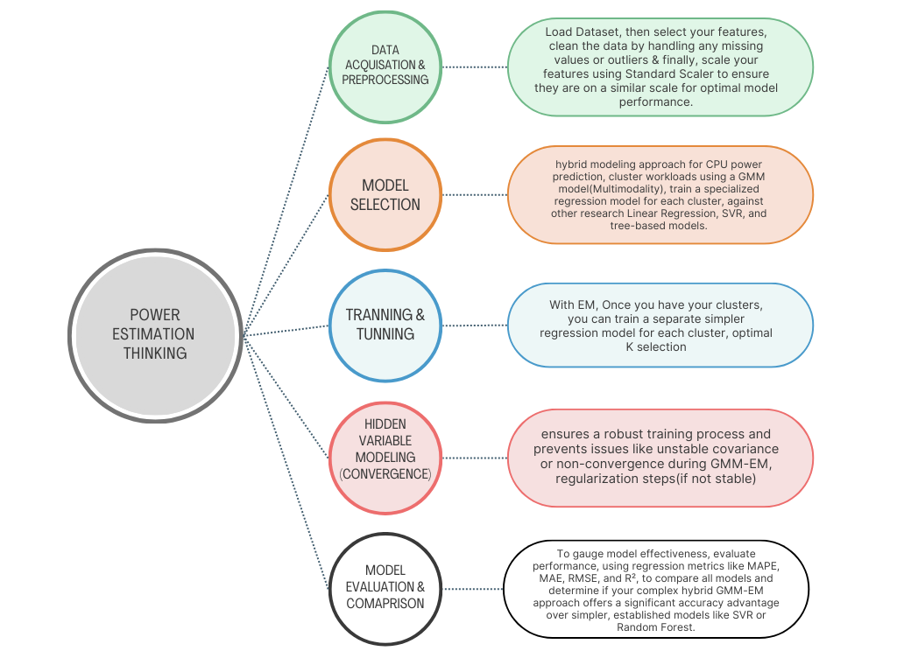    

🎯**Particular problems I am foucusing**

With the advancements in $\textcolor{green}{VLSI \space Technology}$, it is now possible to integrate millions or billions of transistors into a single chip. However,increasing the count of transistors and operating frequencies leads to a significant rise in power consumption. This has emerged as a critical issue, especially in submicron technologies. Therefore, $\textcolor{yellow}{accurate \space power \space estimation \space during \space the \space early \space stages \space of \space VLSI \space circuit \space design \space is \space essential}$, as power consumption greatly affects the overall reliability, can reduce performance of the system and increase redesign time or power optimizing cost at RTL, Algorithmic or Architectural level of any ASICs/FPGA design.

🚀 **Data set I work for**

For power estimation I worked with my model on two dataset. The Simple one (first) by visiting this [Link](https://github.com/arka-lsik/Statistical-Model-for-Power-Consumption-of-VLSI-Circuits-and-Effect-of-Quantized-Audio-Signal/blob/main/Power-Estimation-of-VLSI-circuits/power%20consumption%20of%20ISCAS89%20benchmark%20circuits.csv) you can observe.
- This dataset I taken form $\textcolor{red}{ISCAS'89}$ conference which contains of 20 different bench mark sequential circuits.
- Every benchmark sequential logic is made with various logic gates as a load like NOR, NAND, NOT etc. So total 9 input features.
- At end column its given the Mc(Monte Carlo) in mw simulted power. I have to estimate as close as possible.

As this previous one dataset is Old and with small quantites data of data samples, there may be some limitations to judge this model perfomance at industry level. 
- So next I found the another dataset form $\textcolor{red}{PATMOS'17}$ [Link](https://github.com/arka-lsik/Statistical-Model-for-Power-Consumption-of-VLSI-Circuits-and-Effect-of-Quantized-Audio-Signal/blob/main/Power-Estimation-of-VLSI-circuits/ARM-A15%20CPU%20dataset%20PATMOS'17.csv) conference.
- Consider Odorid-XU3 for this work, which contains an Exynos-5422 SoC with a quad-core ARM Cortex-A7 CPU cluster and a quad-core ARM Cortex-A15 CPU cluster.
- Both types of CPU share the same instruction-set architecture (ISA) but are optimised for different energy/performance design.
- The power measurements data (in the sheet represented) were collected from power sensors built into the ODROID-XU3 platform.
- This work data considers only the higher performance Cortex-A15 cluster.

🎯 **Model Mathematical Descriptions**

The core idea is to model the joint distribution of input features $\textcolor{green}{(X)}$ and target variable $\textcolor{green}{(Y)}$ using a mixture of Gaussian distributions, and then use this joint model to predict $\textcolor{green}{Y \space given \space X}$. Let's break down the mathematics for $\textcolor{green}{1st \space case}$ of dataset- 

*1. The Regression Problem Setup*
- $\textcolor{red}{Features (X):}$ These are input variables (e.g., GATE, AND, INV counts). X is an N×D matrix, where N is the number of data points and D=9 is the number of features.
- $\textcolor{red}{Target (Y):}$ This is the variable I want to predict (Power Consumption). Y is an N×1 vector.
- $\textcolor{red}{Goal:}$ To learn a function f(X)→Y such that for a new circuit with features x, we can predict its power consumption y.

*2. Data Preprocessing: Normalization (Z-score Standardization)*
- $\textcolor{red}{Purpose:}$ (Scale Invariance) Prevents features with larger numerical ranges from disproportionately influencing the model. If 'GATE' count ranges from 10 to 1000 and 'INV' count from 1 to 10, 'GATE' would dominate calculations without scaling.
- $\textcolor{red}{Improved \space Convergence \space for \space EM:}$ Many iterative optimization algorithms (like EM for GMMs) converge faster and more reliably when features are on a similar scale. So this a necessary steps.
- $\textcolor{red}{For \space each \space feature \space (column) \space in \space X \space and \space for \space Y:}$
  The equations are:

$$
x'_{ij} = \frac{x_{ij} - \mu_j}{\sigma_j}
$$

$$
y'_i = \frac{y_i - \mu_Y}{\sigma_Y}
$$

Where:
- $$x'_{ij}$$ is the normalized value of the i-th data point for the j-th feature.
- $$\mu_j$$ is the mean of the j-th feature.
- $$\sigma_j$$ s the standard deviation of the j-th feature.
- $$\mu_Y , \sigma_Y$$ are the mean and standard deviation of the target variable Y
In code particularly if I say
- $$[X_norm, \mu_X, \sigma_X]$$ = zscore(X); performs this for features.
- $$Y_norm = (Y - mean(Y)) / std(Y)$$; performs this for the target.
- $$XY_norm = [X_norm Y_norm]$$; combines them into a single matrix for GMM fitting. Each row now represents a D+1 dimensional data point $$z_n = [x_n, y_n]$$ in the normalized space.

*3. Gaussian Mixture Model (GMM) -*
- $\textcolor{red}{Concept:}$ A GMM assumes that your data points ($$z_n$$ which are $$[x_n, y_n]$$ in my case) are generated from a finite number of underlying Gaussian (Normal) distributions. These distributions are mixed together with certain probabilities.
- $\textcolor{red}{Why \space for \space Regression?}$ Instead of directly trying to model the relationship Y=f(X), GMMs allow to model the joint probability distribution p(X,Y). Once we have p(X,Y), we can derive the conditional probability distribution p(Y∣X) to make predictions.
- $\textcolor{red}{Mathematical \space Representation:}$ The probability density function (PDF) of a GMM for a data point z is given by -
  
$$
p(z \mid \theta) = \sum_{k=1}^{K} \pi_k \, \mathcal{N}(z \mid \mu_k, \Sigma_k)
$$

where:
- K: The number of Gaussian components (mixtures). This is the K you choose in your code.
- $$\pi_k$$ : The mixing coefficient (or prior probability) for the k-th component. It represents the probability that a randomly chosen data point belongs to the k-th component. $$\sum_{k=1}^{K} \pi_k = 1$$
- $$\mathcal{N}(z \mid \mu_k, \Sigma_k)$$ : The multivariate Gaussian distribution for the k-th component. $$\mu_k$$ The mean vector of the k-th Gaussian component. For your combined data z=[x,y], $$\mu_k$$ will have D+1 elements. $$\Sigma_k$$ The covariance matrix of the k-th Gaussian component. This symmetric matrix describes the spread and correlation of the variables within that component. Its size will be (D+1)×(D+1).
- θ: The complete set of all GMM parameters that need to be learned from the data: $$\pi_k$$, $$\mu_k$$, $$\Sigma_k$$ for k=1,…,K.
  

*4. Expectation-Maximization (EM) Algorithm - Learning the GMM Parameters*
- $\textcolor{red}{Purpose:}$ Given the observed data points (XYnorm), the EM algorithm is used to estimate the unknown GMM parameters (θ) when we don't know which data point belongs to which Gaussian component. It's an iterative approach.
- $\textcolor{red}{The \space "Hidden" \space Variable:}$ The "hidden" information is the component assignment for each data point. We don't directly observe this.
- $\textcolor{red}{Initialization:}$ Iterative Steps: Start with some initial guesses for $$\pi_k$$, $$\mu_k$$, $$\Sigma_k$$ (e.g., random, or using k-means clustering to find initial centroids).
- $\textcolor{red}{E-step \space (Expectation \space Step):}$ ssuming the current parameters are correct, calculate the "responsibility" (or posterior probability) that each component k has for generating each data point $$z_n$$ -

$$
\gamma(z_n, k) = p(k \mid z_n, \theta^{\text{old}}) = \frac{\pi_k^{\text{old}} \, \mathcal{N}(z_n \mid \mu_k^{\text{old}}, \Sigma_k^{\text{old}})}{\sum_{j=1}^{K} \pi_j^{\text{old}} \, \mathcal{N}(z_n \mid \mu_j^{\text{old}}, \Sigma_j^{\text{old}})}
$$

This step essentially quantifies "how much" each data point belongs to each cluster. 

- $\textcolor{red}{M-step \space (Maximization \space step):}$
  - Using the responsibilities calculated in the E-step, update the GMM parameters ($$\pi_k$$, $$\mu_k$$, $$\Sigma_k$$) to maximize the likelihood of the data.
  - Effective Number of Points for Component k: $$N_k = \sum_{n=1}^{N} \gamma(z_n, k)$$
  - Update Mixing Coefficients: $$\pi_k^{\text{new}} = \frac{N_k}{N}$$
  - Update Mean Vectors: $$\mu_k^{\text{new}} = \frac{1}{N_k} \sum_{n=1}^{N} \gamma(z_n, k) \, z_n$$
  - Update Covariance Matrices: $$\Sigma_k^{\text{new}} = \frac{1}{N_k} \sum_{n=1}^{N} \gamma(z_n, k) \, (z_n - \mu_k^{\text{new}})(z_n - \mu_k^{\text{new}})^T$$

- $\textcolor{red}{Convergence \space Check:}$ Repeat E and M steps until the change in log-likelihood (or parameters) between iterations is smaller than a predefined tolerance or a maximum number of iterations (MaxIter) is reached.
- $\textcolor{red}{RegularizationValue:}$ This parameter adds a small positive constant to the diagonal of the covariance matrices during the M-step. Its purpose is to:
  - $\textcolor{green}{Prevent \space Singularity:}$ Covariance matrices can become singular (non-invertible) if a component has very few data points, or if data points within a component lie perfectly on a lower-dimensional subspace. Singular matrices cause mathematical errors.
  - $\textcolor{green}{Improve \space Stability:}$ It helps stabilize the EM algorithm, especially in early iterations or with problematic data.

*5. Conditional GMM for Prediction* -  
Once the GMM parameters ($$\pi_k$$, $$\mu_k$$, $$\Sigma_k$$) are learned from the training data, we can use them to make predictions for new, unseen feature vectors $$X_{new}$$. The key here is using the properties of multivariate Gaussian distributions
- $\textcolor{red}{Partitioning \space the \space Mean \space and \space Covariance}$: Each component's mean $$\mu_k$$ and covarience $$\Sigma_k$$ are partitioned into parts corresponding to features (x) and the target (y). Let,

$$
z = \begin{bmatrix} x \\ y \end{bmatrix}^{T}
$$

Then for each component \( k \):

$$
\mu_k = \begin{bmatrix} \mu_x^{(k)} \\ \mu_y^{(k)} \end{bmatrix}^{T}
$$

where

$$\( \mu_x^{(k)} \) is \( D \times 1 \), \space \( \mu_y^{(k)} \) is \( 1 \times 1 \)$$

- $\textcolor{red}{The \space covariance \space matrix}$:

 $$
    \Sigma_k = \begin{bmatrix}
    \Sigma_{xx}^{(k)} & \Sigma_{xy}^{(k)} \\
    \Sigma_{yx}^{(k)} & \Sigma_{yy}^{(k)}
    \end{bmatrix}
    $$ 
    
 where,
 
 $$\Sigma_{xx}^{(k)} is \(D \times D\), \space \Sigma_{xy}^{(k)} is \(D \times 1\), \space \Sigma_{yx}^{(k)} is \(1 \times D\), \space \Sigma_{yy}^{(k)} is \(1 \times 1\)$$

- $\textcolor{red}{Conditional \space Gaussian \space Properties}$: If a joint distribution p(x,y) is Gaussian, then the conditional distribution p(y∣x) is also Gaussian,
  - $\textcolor{red}{Conditional \space Mean}$: $$\mu_{y \mid x}^{(k)} = \mu_y^{(k)} + \Sigma_{yx}^{(k)} \left( \Sigma_{xx}^{(k)} \right)^{-1} (x - \mu_x^{(k)})$$

   - $\textcolor{red}{Conditional \space Variance}$: $$\Sigma_{yy \mid x}^{(k)} = \Sigma_{yy}^{(k)} - \Sigma_{yx}^{(k)} \left( \Sigma_{xx}^{(k)} \right)^{-1} \Sigma_{xy}^{(k)}$$

   - $\textcolor{red}{Prediction \space for \space GMM}$: 
     Where $$\hat{\pi}_k(x)$$ is the posterior probability of component k given observation x 

$$
\hat{\pi}_k(x) = p(k \mid x) = \frac{\pi_k \, \mathcal{N}\!\left(x \mid \mu_x^{(k)}, \Sigma_{xx}^{(k)}\right)} {\sum_{j=1}^{K} \pi_j \, \mathcal{N}\!\left(x \mid \mu_x^{(j)}, \Sigma_{xx}^{(j)}\right)}
$$

  - $\textcolor{red}{prediction:}$ $Y_{pred}$  

To get a single point prediction for $Y$ given $x$, calculate the expected value of $Y$ given $x$, which is the weighted average of the conditional means from each component:

$$
\mathbb{E}[Y \mid x] = \sum_{k=1}^{K} \hat{\pi}_k(x) \, \mu_{y \mid x}^{(k)}
$$

    
  - $\textcolor{red}{Uncertainty:}$  

These are attempts to calculate the variance of the prediction. For a GMM, the total conditional variance $\mathrm{Var}[Y \mid x]$ is not simply the weighted average of $\Sigma_{yy \mid x}^{(k)}$. It needs to account for both the variance within each component's conditional distribution and the variance between the conditional means of the different components. The correct formula for the variance of a mixture is:

$$
\mathrm{Var}[Y \mid x] = \sum_{k=1}^{K} \hat{\pi}_k(x) \Big( \Sigma_{yy \mid x}^{(k)} + (\mu_{y \mid x}^{(k)} - \mathbb{E}[Y \mid x])^2 \Big)
$$

This allows estimating not just the predicted power but also its associated uncertainty.

*6. Model Selection: AIC and BIC* -
- $\textcolor{red}{Purpose}$: To select the optimal number of components (K) for the GMM. A larger K allows for more complex models that might fit the training data better, but risk overfitting. AIC and BIC balance fit with complexity.
- $\textcolor{red}{Log-Likelihood}$: $$\ln(\hat{L})$$ Both criteria depend on the maximum value of the log-likelihood function for the fitted GMM. The log-likelihood measures how well the model explains the observed data. A higher log-likelihood means a better fit.
- $\textcolor{red}{Number \space of \space Parameters}$: For a GMM with K components in a D+1 dimensional space.
- $\textcolor{red}{Formulas}$:
  - AIC (Akaike Information Criterion): $$2k - 2\ln(\hat{L})$$
  - BIC (Bayesian Information Criterion): $$k\ln(N) - 2\ln(\hat{L})$$
  - Interpretation: For both, lower values are better. They quantify the trade-off between model fit and complexity. BIC generally penalizes complexity more strongly, especially for larger datasets (N), leading to simpler models.

*7. Evaluation Metrics*  
These metrics quantify how well your model's predictions $Y_{pred-test}$ match the actual $Y_{test}$ values on the unseen test data.
- $\textcolor{red}{MAE \space (Mean \space Absolute \space error)}$: Average absolute difference between predicted and actual values. Easy to understand, robust to outliers. Units are the same as your target (mW): $\text{MAE} = \frac{1}{N_{\text{test}}} \sum_{i=1}^{N_{\text{test}}} \left| Y_{\text{test},i} - Y_{\text{pred},i} \right|$

- $\textcolor{red}{RMSE \space (Root \space Mean \Square \space Error)}$: Average magnitude of the errors. Penalizes larger errors more heavily due to the squaring term. Units are also mW : $\text{RMSE} = \sqrt{\frac{1}{N_{\text{test}}} \sum_{i=1}^{N_{\text{test}}} \left( Y_{\text{test},i} - Y_{\text{pred},i} \right)^2}$

- $\textcolor{red}{R\text{-}Squared\ (R^2\ \text{or Coefficient of Determination})}$

$$
R^2 = 1 - \frac{\sum_{i=1}^{N_{\text{test}}} \big( Y_{\text{test},i} - \bar{Y}_{\text{test}} \big)^2}{\sum_{i=1}^{N_{\text{test}}} \big( Y_{\text{test},i} - Y_{\text{pred},i} \big)^2}
$$

- $R^2 = 1$: Perfect fit.  
- $R^2 = 0$: The model explains no variability (predictions are no better than simply predicting the mean of $Y$).  
- $R^2 < 0$: The model is worse than simply predicting the mean.

🖼️ **Results and Discussions 1**
Lets conclude with the results part discussion brifely. The discussion of this below figures are coming out on the experiment of $\textcolor{green}}{1st \space dataset}$.
- The $\textcolor{red}{Fig1}$ orange line represents the linear power trend derived from the Monte Carlo–simulated power data (in mW). The blue markers indicate the estimated power data samples.
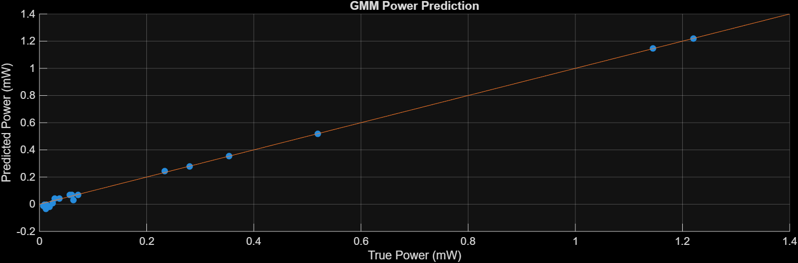
- $\textcolor{red}{Fig2}$ The histogram of prediction errors shows how frequently different error values occur when comparing the predicted power to the actual power. The errors range from about –0.02 mW to +0.06 mW, where negative values indicate overestimation and positive values indicate underestimation. Most of the errors are concentrated close to zero, particularly between 0 and 0.02 mW, which suggests that the model is generally accurate. A smaller number of samples fall into the negative error range (around –0.02 mW), while a few extend into larger positive errors (0.05–0.06 mW). This pattern indicates that the model has a slight bias toward underestimating the true power, though the overall spread of errors is small, demonstrating consistent performance. Overall, the distribution confirms that the model makes reliable predictions with only minor deviations around the true values.
  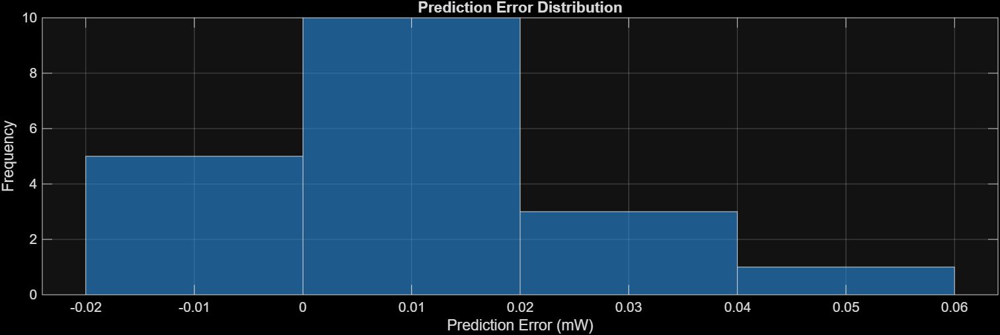
- $\textcolor{red}{Fig3}$ The plot compares AIC and BIC scores for different model sizes K, where lower values indicate a better balance between accuracy and complexity. Both criteria drop sharply at K=2, showing that a two-component model is a clear improvement over a single one. BIC reaches its lowest point at K=2, suggesting it as the optimal choice, while AIC continues to decrease slightly for K=4 and 
K=5, indicating it favors a slightly more complex model. Overall, BIC prefers the simpler two-component model, while AIC allows for a bit more complexity. SO right thinking of choice will se when we clusterd results Later.
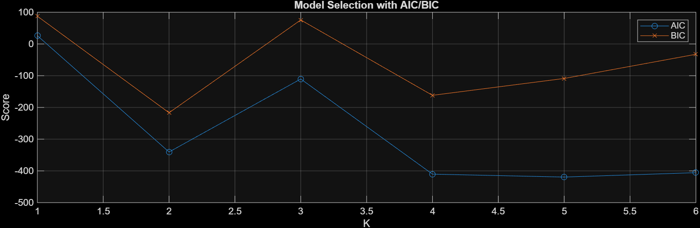
- $\textcolor{red}{Fig4 \space Fig5 \space Fig6\}$ showed the exact estimation accuracy in terms of *Evaluation Matrix* called *MAE(Mean Absolute Error*, *RMSE(Root Mean Square Error* and *R-Squared model fit* in histogram format and also presented the campariablity betwwen different models (eg. LR, RF, NN etc. ) for understanding. By visiting this [Link](https://github.com/arka-lsik/Statistical-Model-for-Power-Consumption-of-VLSI-Circuits-and-Effect-of-Quantized-Audio-Signal/blob/main/Power-Estimation-of-VLSI-circuits/ResultsDataset1.csv), you can observe the exact values I got in every cases for different evaluation metrices.
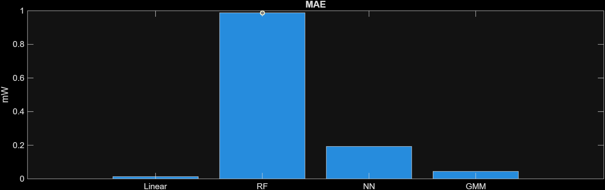
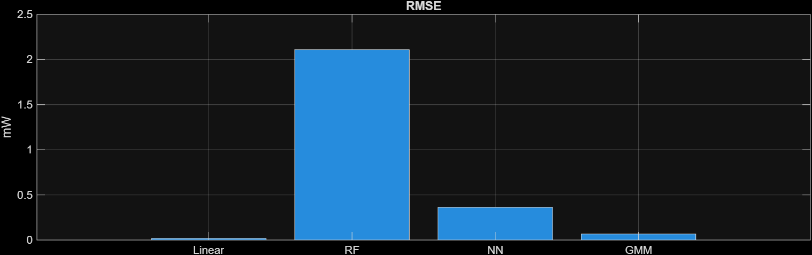
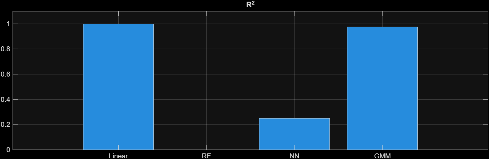

- $\textcolor{red}{Fig7}$ lastly shown in the fromat of clusterd way estimation of power samples from 20 sequenctial benchmark circits. earlier AIC/BIC plot suggested K=2 is the optimal choice (because BIC penalizes complexity more strongly), here the model has been fitted with K=3. That’s why the scatter plot is labeled with three distinct clusters.
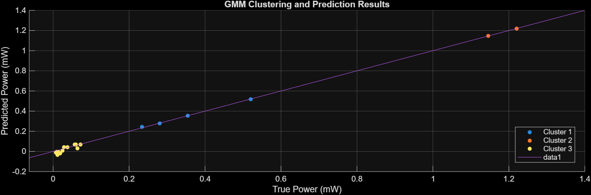

🖼️ **Results and Discussions 2**
As I said the previous dataset is Old and with small quantites data of data samples, there may be some limitations to judge this model perfomance at industry level. So to experiment more on this model I taken Another Dataset [Link](https://github.com/arka-lsik/Statistical-Model-for-Power-Consumption-of-VLSI-Circuits-and-Effect-of-Quantized-Audio-Signal/blob/main/Power-Estimation-of-VLSI-circuits/ARM-A15%20CPU%20dataset%20PATMOS'17.csv).
$\textcolor{red}{General \space Discussion \space about \data}
- This data is taken out from *PATMOS'17* conference, The power measurement samples collected from power sensor  built into the ODROID-XU3 platform, which contains an
 Exynos-5422 SoC with a quad-core ARM Cortex-A7 CPU cluster and a quad-core ARM Cortex-A15 CPU cluster.
- Both types of CPU share the same instruction-set architecture (ISA) but are optimised for different energy/performance design points.
- This workconsiders only the higher performance Cortex-A15 cluster. The four Cortex-A15 CPUs each have 32 KB instruction and data caches, and share a 2 MB L2-cache.
- The clock frequency of the Cortex-A15 cluster ranges from 200 MHz to 2 GHz. The SoC also has 2 GB LPDDR3 RAM.
- The Cortex-A15 power models use the following seven PMCs(power Manegment cells):
  -  0x11 CYCLE COUNT: active CPU cycles
  -  0x1B INST SPEC: instructions speculatively executed
  -  0x50 L2D CACHE LD: level 2 data cache accesses read
  -  0x6A UNALIGNED LDST SPEC: unaligned accesses
  -  0x73 DP SPEC: instructions speculatively executed, integer data processing
  -  0x14 L1I CACHE ACCESS: level 1 instruction cache accesses
  -  0x19 BUS ACCESS: bus accesses
- For this work I consider 5 sets of events 0x11, Ox1b, 0x50, 0x14, 0x19.
- Here in the dataset there are 2160 rows of workloads, with 8 features (frquency, Core count, voltage, five Events activity).
- Let discuss the results:
- The GMM power prediction results with K=7 show that the predicted values align closely with the true power values along the diagonal line, indicating good model performance overall. At lower power levels (0–2 W), predictions are highly accurate with minimal spread, while at higher power levels (above ~2 W) the variance increases and some deviations from the diagonal appear, showing reduced accuracy. The clustering captures different regions of the data effectively, but the results suggest the model performs best for low-to-moderate power ranges and could benefit from refinement or additional data to improve predictions at higher power outputs.
  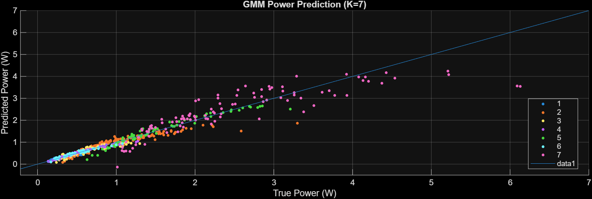
-  The plot shows the Bayesian Information Criterion (BIC) values for different numbers of components K in the GMM model. The BIC decreases sharply from K=1 to K=4, indicating significant improvement in model fit. After K=4, the reduction in BIC becomes more gradual, with the lowest value observed around K=7, suggesting that a 7-component model offers the best trade-off between model complexity and fit quality.
 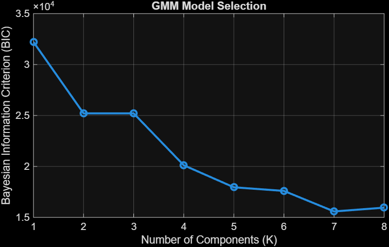
- The histogram shows the distribution of prediction errors for the GMM model. Most errors are centered around zero, with a sharp peak indicating that the majority of predictions are very close to the true values. The error spread is narrow, with only a few larger deviations extending beyond ±1 W. This suggests that the GMM model provides accurate and consistent predictions, with only occasional outliers.
  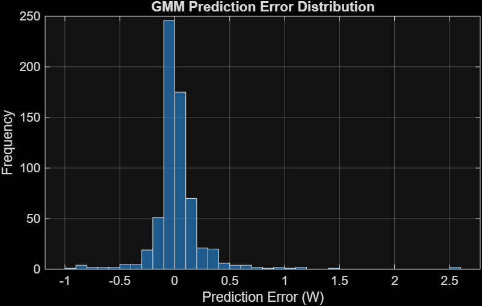

## 🔍 **Links to be visited for more details**
 ## 🌟 **Acknowledgments**
 - This work began about 1.2 years ago with a very simple idea inspired by Information Theory.
 - My curiosity and enthusiasm for the VLSI design process encouraged me to explore this direction further.
 - Initially, I was engaged in signal processing research, specifically focusing on audio compression.
 - Over time, I became familiar with machine learning algorithms, approaching them as mathematical tools to address broader challenges rather than problem-specific methods.
 - After overcoming the initial hurdles, I realized the beauty and potential of my earlier work, which opened doors for deeper research.
 - This naturally led me to focus on power estimation in the early stages of design, an idea inspired not only by my own algorithmic thinking but also by concepts from a Low Power Design Techniques course.
 - I am deeply grateful to Prof. Ritwik Kumar Layek, who consistently encouraged me to think beyond conventional approaches and explore unconventional areas of research.
 - I also thank the Department of Electronics and Electrical Communication Engineering, IIT Kharagpur, and my generous friends who supported me through discussions in the lab, classroom, and even during tea breaks at the canteen.
 - Finally, I feel fortunate that this journey has helped me grow intellectually and progress toward more complex and meaningful thinking.

## ⭐ **If you find this project helpful, feel free to star the repo and share your feedback!** ⭐

    

